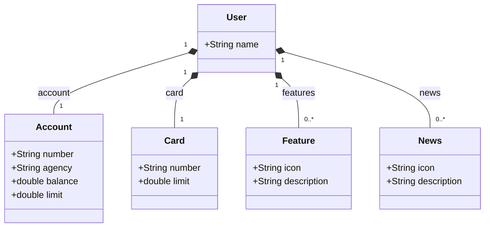

# Publicando API Rest

Java RESTful criada para o programa Deal - Spring Boot e Angular da Dio

## Diagrama de Classes

```mermaid
classDiagram

class User {
    +String name
}

class Account {
    +String number
    +String agency
    +double balance
    +double limit
}

class Card {
    +String number
    +double limit
}

class Feature {
    +String icon
    +String description
}

class News {
    +String icon
    +String description
}

User "1" *-- "1" Account : account
User "1" *-- "1" Card : card
User "1" *-- "0..*" Feature : features
User "1" *-- "0..*" News : news
```
